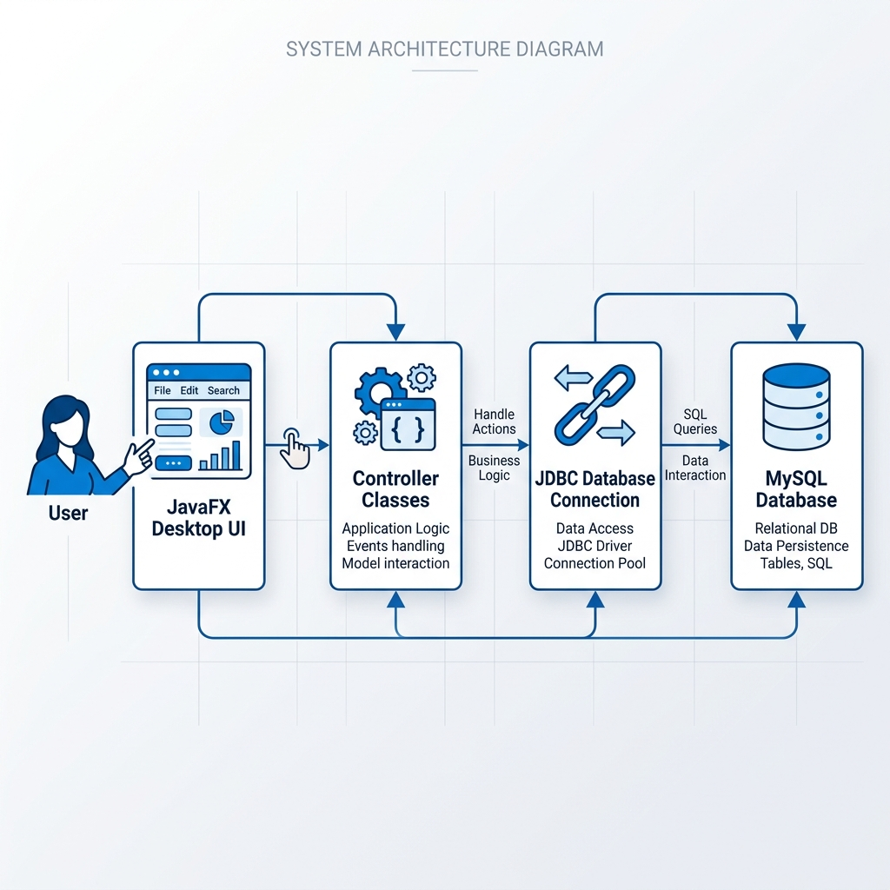
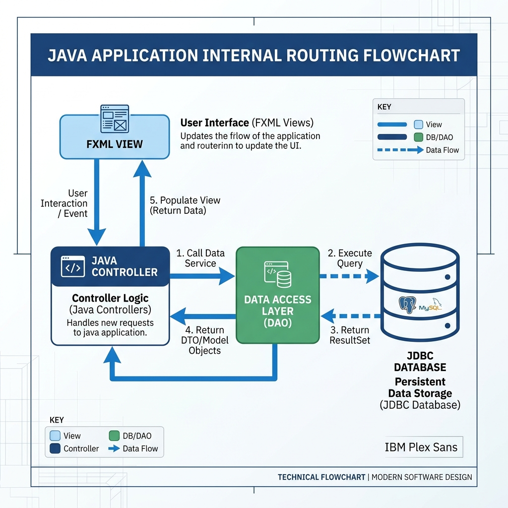
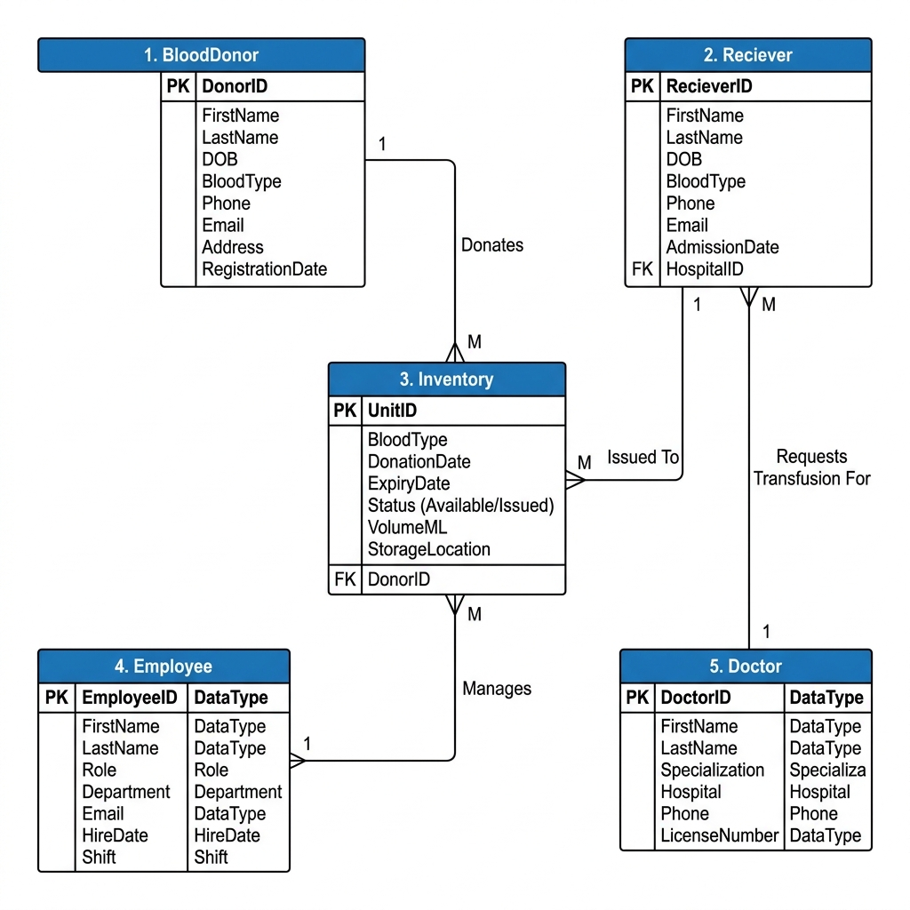

<h1 align="center">🩸 Blood Bank Management System</h1>

  <b>JavaFX-based desktop application for donor tracking, blood inventory, recipient requests, and staff administration.</b>

  
  
  
  

<h2>📌 Project Overview</h2>

  <b>Blood Bank Management System</b> is a robust and scalable
  <b>JavaFX desktop application</b> designed to simplify blood bank operations.
  It helps manage donors, blood inventory, recipient requests, doctors, and staff
  through a clean and secure architecture.

<h2>🏗️ System Architecture</h2>

  

<h2>🚀 Key Features</h2>

<table>
  <tr>
    <td>🔴 <b>Donor Management</b></td>
    <td>Create, read, update, and delete donor profiles.</td>
  </tr>
  <tr>
    <td>🩸 <b>Real-time Inventory</b></td>
    <td>Track available blood units by blood group.</td>
  </tr>
  <tr>
    <td>🧑‍⚕️ <b>Request Handling</b></td>
    <td>Manage recipient blood requests efficiently.</td>
  </tr>
  <tr>
    <td>👨‍⚕️ <b>Staff Administration</b></td>
    <td>Manage doctors, admins, and operational staff.</td>
  </tr>
  <tr>
    <td>🎨 <b>Modern UI</b></td>
    <td>JavaFX and CSS-based clean desktop interface.</td>
  </tr>
  <tr>
    <td>🔐 <b>Secure Data Handling</b></td>
    <td>Uses JDBC PreparedStatement to reduce SQL injection risk.</td>
  </tr>
</table>

<h2>🔄 API / Application Flow</h2>

  

<h2>🗄️ Database Schema</h2>

  

<h2>🧰 Tech Stack</h2>

<table>
  <tr>
    <th>Category</th>
    <th>Technology</th>
  </tr>
  <tr>
    <td>Language</td>
    <td>Java 17+</td>
  </tr>
  <tr>
    <td>UI Framework</td>
    <td>JavaFX</td>
  </tr>
  <tr>
    <td>Database</td>
    <td>MySQL 8+</td>
  </tr>
  <tr>
    <td>Connectivity</td>
    <td>JDBC</td>
  </tr>
  <tr>
    <td>Build / Run</td>
    <td>CLI / IntelliJ IDEA / Eclipse</td>
  </tr>
</table>

<h2>⚙️ Setup & Installation</h2>

<h3>1. Prerequisites</h3>

<ul>
  <li>JDK 17 or higher</li>
  <li>JavaFX SDK</li>
  <li>MySQL Server</li>
  <li>MySQL Connector/J</li>
</ul>

<h3>2. Database Initialization</h3>

<pre><code class="language-sql">CREATE DATABASE BloodManagement;
USE BloodManagement;</code></pre>

Then import the SQL file:

<pre><code class="language-bash">mysql -u root -p BloodManagement &lt; database/bloodmanagement.sql</code></pre>

<h3>3. Configuration</h3>

Create a <code>config.properties</code> file in the project root:

<pre><code class="language-ini">db.url=jdbc:mysql://localhost:3306/BloodManagement
db.user=your_username
db.password=your_password</code></pre>

<blockquote>
  ⚠️ Never push <code>config.properties</code> to GitHub.
</blockquote>

<h3>4. Run the Application</h3>

<pre><code class="language-bash">./run.bat</code></pre>

Or manually:

<pre><code class="language-bash">javac -cp ".;lib/*" -d out src/**/*.java
java -cp ".;out;lib/*" blood.management.BloodManagement</code></pre>

<h2>🔐 Security Best Practices</h2>

<ul>
  <li>Use <code>PreparedStatement</code> for all database queries.</li>
  <li>Keep database credentials outside source code.</li>
  <li>Add sensitive files to <code>.gitignore</code>.</li>
  <li>Never commit admin credentials, private keys, public keys, PDFs, DOCX files, or local config files.</li>
</ul>

<h3>Recommended <code>.gitignore</code></h3>

<pre><code class="language-gitignore">config.properties
.env
.env.*
*.key
*.pem
*.p12
*.jks
*.pdf
*.docx
*.doc
*.xlsx
*.xls
out/
target/
bin/
*.class
.idea/
.vscode/
.DS_Store</code></pre>

<h2>📁 Project Assets</h2>

<pre><code>assets/
└── images/
    ├── architecture_flow_1777823205962.png
    ├── api_flow_1777823228029.png
    └── database_schema_1777823243514.png</code></pre>

<h2>👨‍💻 Author</h2>

  <b>Shivshankar Mali</b> 
  Full Stack Developer

<ul>
  <li><b>GitHub:</b> <a href="https://github.com/shiv123-coder">@shiv123-coder</a></li>
  <li><b>Project:</b> <a href="https://github.com/shiv123-coder/Blood-Bank-Management">Blood Bank Management System</a></li>
</ul>

  <b>Developed with ❤️ for better healthcare management.</b>

