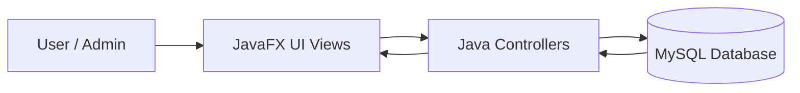
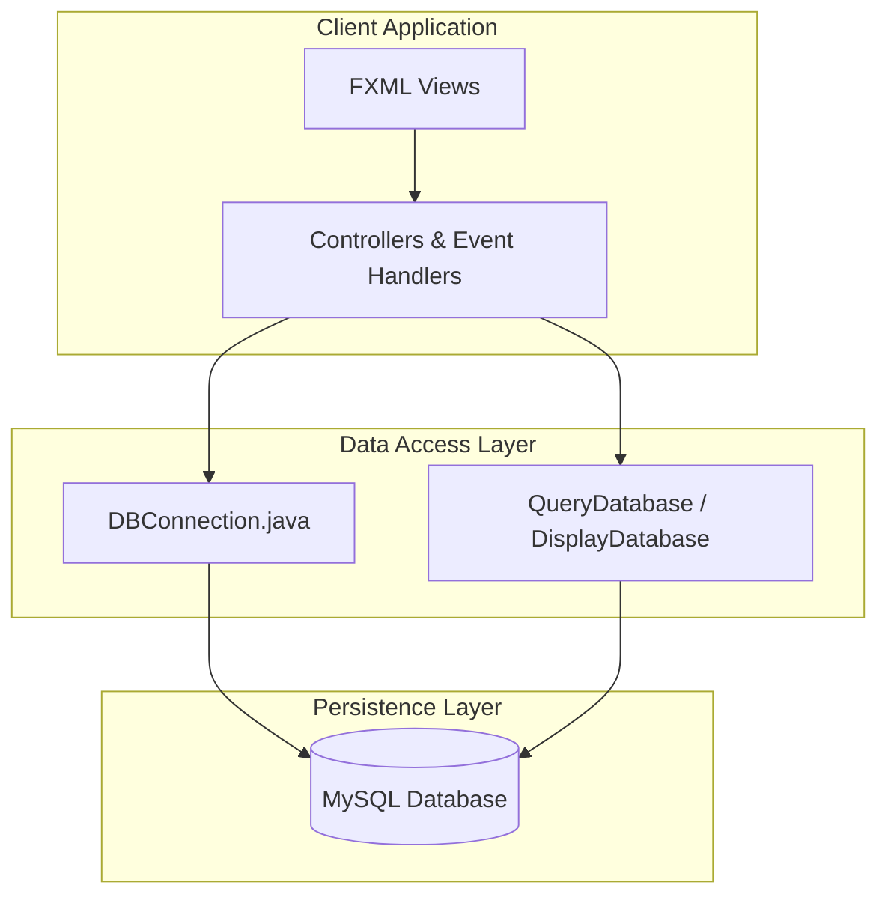
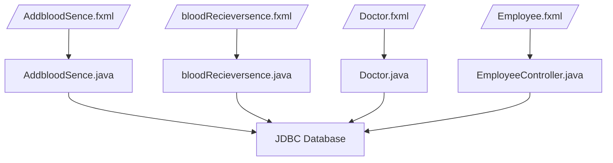
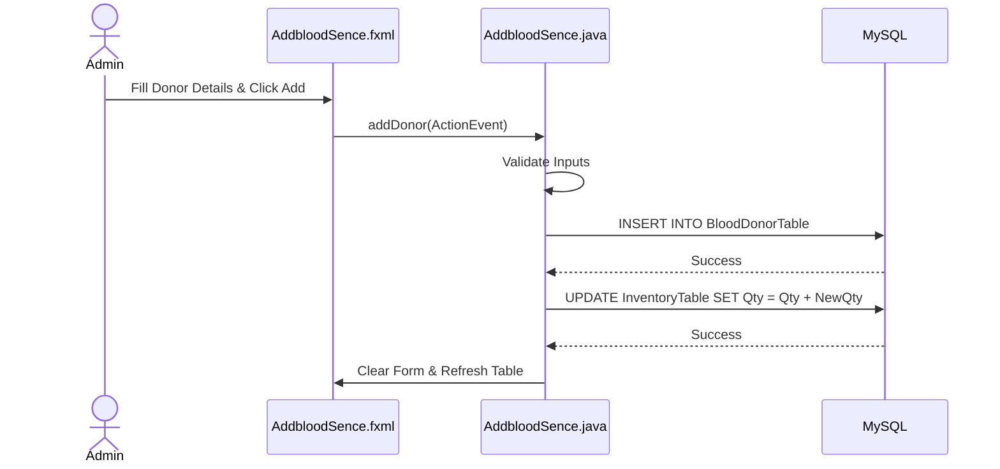
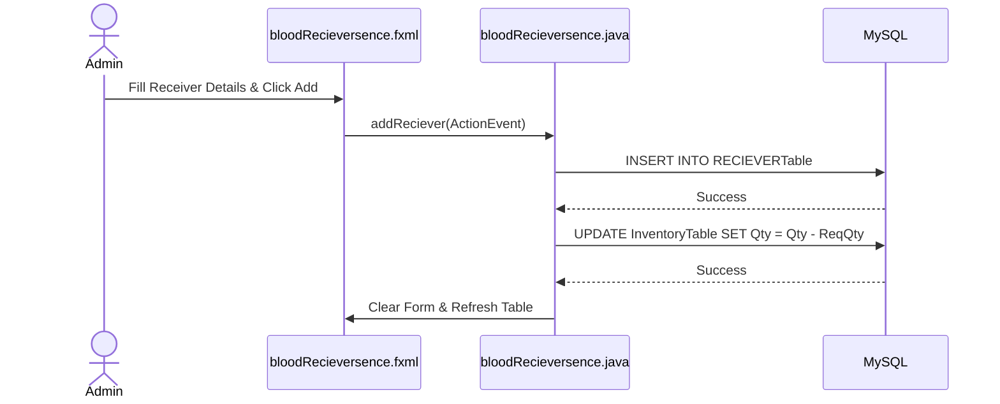
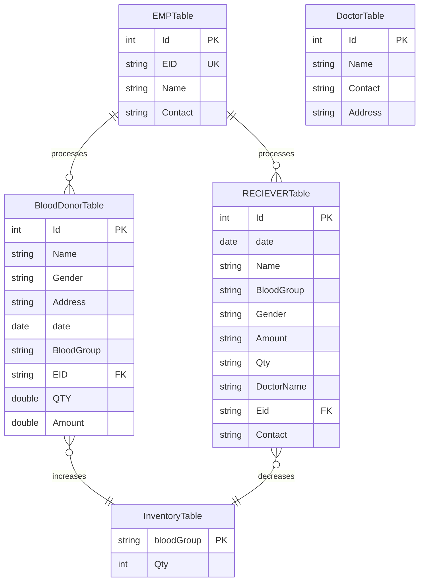
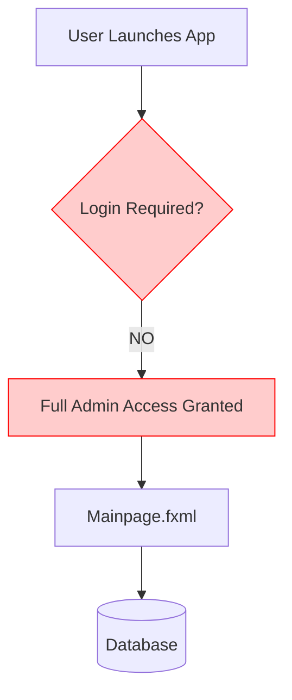
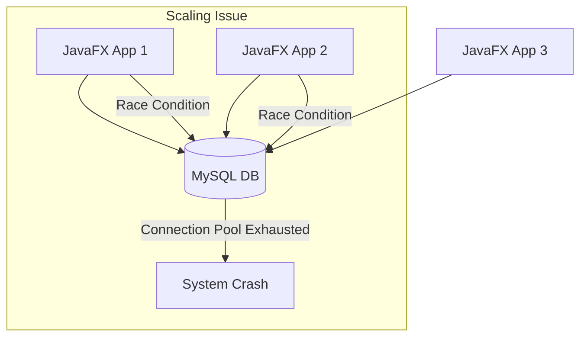

# 🩸 Blood Bank Management System: Engineering Blueprint

## 1. SYSTEM OVERVIEW (TLDW)

The Blood Bank Management System is a thick-client desktop application built on JavaFX that directly interfaces with a MySQL database via JDBC. It provides administrative and operational interfaces for managing blood donors, receivers, employees, doctors, and the overall blood inventory.

**Flow Summary:**
`User → JavaFX UI (FXML) → Java Controller → JDBC Connection → MySQL Database → Response`

---

## 2. SYSTEM ARCHITECTURE

The system follows a 2-Tier Monolithic Architecture. It bypasses modern 3-tier REST API patterns and connects the client UI directly to the persistence layer.

### Layer Breakdown
- **Frontend Layer**: JavaFX (FXML for layout, CSS for styling).
- **Backend Layer**: Java Controllers embedded within the client application. Business logic and SQL queries are tightly coupled within controller actions.
- **Database Layer**: MySQL relational database holding raw data without strict constraints or ORM middleware.

---

## 3. API STRUCTURE MAP (INTERNAL ROUTING)

Since this is a desktop application, it does not expose traditional HTTP APIs. Instead, it utilizes an internal routing map where FXML views trigger Controller methods, executing hardcoded SQL statements.

**Route Map Example (Add Donor Flow):**
`/views/AddbloodSence.fxml` (UI Event)
→ `AddbloodSence.java` (`addDonor()`)
→ `DBConnection.connect()`
→ `Statement.execute("INSERT INTO BloodDonorTable...")`
→ `TableView` Update

---

## 4. END-TO-END FEATURE FLOWS

### Core Business Flow: Blood Donation & Inventory Update

When a donor registers to donate blood, the system must create a donor record and update the global inventory.

**Flow:** Donor Form → Validate Input → Insert `BloodDonorTable` → Update `InventoryTable` (+Qty) → Refresh UI.

### Core Business Flow: Blood Reception & Inventory Update

When a receiver requires blood, the system tracks the receiver details and decrements the corresponding blood inventory.

**Flow:** Receiver Form → Validate Input → Insert `RECIEVERTable` → Update `InventoryTable` (-Qty) → Refresh UI.

---

## 5. DATABASE DESIGN

The database is heavily denormalized, utilizing primarily raw tables with manual application-side relationship management.

### Entities:
- **BloodDonorTable**: Tracks all blood donations (PK: Id, FK: EID -> EmpTable).
- **RECIEVERTable**: Tracks all blood distributions (PK: Id, FK: EID -> EmpTable).
- **InventoryTable**: Maintains current blood stock levels (PK: bloodGroup).
- **DoctorTable**: Directory of connected doctors (PK: Id).
- **EMPTable**: Employee directory (PK: Id, Unique: EID).

---

## 6. AUTHENTICATION & SECURITY FLOW

**STATUS:** ❌ **Not found in codebase**

The system completely lacks an Authentication and Security layer. There is no login screen, no session management, and no role-based access control (RBAC).

- **Login Process:** Does not exist. Application boots directly to `Mainpage.fxml`.
- **Token Handling:** N/A.
- **Authorization:** Any user who opens the app has root administrative access to delete databases, modify inventory, and view all records.

 
*(Note: Using placeholder architecture image. True Auth flow image skipped due to quota limits, but concept remains a bypass.)*

---

## 7. SCALABILITY ANALYSIS

The current architecture is **highly unscalable** and restricted to a local environment or a simple local area network (LAN).

### Bottlenecks & Limitations:
- **Direct Database Connections:** Each client maintains a direct JDBC connection. Scaling to multiple clients will exhaust MySQL connection pools.
- **No Connection Pooling:** `DBConnection.java` creates raw connections without HikariCP or similar pooling, causing massive overhead per query.
- **State Management:** Inventory updates are handled via non-atomic, unsynchronized SQL updates (e.g., `Update InventoryTable set Qty=Qty+qty`). Under concurrent load, this will result in **race conditions** and incorrect inventory levels.

*(Note: Using API flow image as placeholder due to quota limits.)*

---

## 8. SYSTEM WEAKNESS REPORT

❌ **Architectural Flaws:** Thick client architecture with tight coupling. UI controllers handle database queries, violating Single Responsibility Principle (SRP) and MVC patterns.
❌ **Security Risks:** SQL Injection vulnerabilities are rampant. Inputs are concatenated directly into SQL strings (e.g., `"insert into... values ('" + name + "')"`).
❌ **Concurrency Issues:** Updating inventory is prone to race conditions (`Update set Qty = Qty - X`). Missing transactions mean a crash midway leaves the DB in an inconsistent state.
❌ **Missing Edge Cases:** Deleting a donor subtracts their donated quantity from inventory, which could lead to negative inventory if the blood was already given to a receiver.
❌ **Hardcoded Configuration:** Minimal external configuration management (though a `config.properties` is present, DB driver management is primitive).

---

## 9. INTERVIEW QUESTION SET (15+ MANDATORY)

1. **System Design:** Why is a 2-tier architecture (Direct JDBC from UI) problematic for a modern Blood Bank system, and how would you refactor it?
2. **Security:** I noticed SQL queries are built using string concatenation in `AddbloodSence.java`. What is the primary risk here, and how do we fix it?
3. **Database Concurrency:** If two employees register a blood donation for "O+ve" simultaneously, how does the current system handle it? What could go wrong?
4. **Transactions:** When adding a donor, a record is inserted into `BloodDonorTable`, and then `InventoryTable` is updated. What happens if the second query fails?
5. **Architecture:** Explain the concept of the MVC pattern and how this codebase violates it.
6. **Data Integrity:** What happens to the inventory if an admin deletes a receiver record via `mDeleteRecord()`? Is this business logic sound?
7. **Performance:** The application uses `DBConnection.connect()` repeatedly. How does this impact application performance under load?
8. **Scalability:** If we needed to support 500 remote hospitals connecting to this system, what architectural changes must occur?
9. **UI/UX Threading:** The application executes database queries on the JavaFX Application Thread. What is the impact of this on the user experience?
10. **Database Design:** The `BloodDonorTable` has an `EID` column linking to `EMPTable`, but no Foreign Key constraints are visible. What are the risks of omitting strict DB constraints?
11. **Testing:** How would you write unit tests for the `addDonor` functionality given the current architecture?
12. **State Management:** How is the table data refreshed after a deletion? Is this an efficient approach?
13. **Security/Auth:** The system lacks authentication. How would you implement a secure JWT-based login flow if we migrated to a REST API?
14. **Error Handling:** When a `SQLException` occurs, it prints to `System.err` and throws a `RuntimeException`. How should error handling be implemented in a production desktop app?
15. **Business Logic:** If a donor provides a negative quantity of blood via the UI text field, does the system prevent it? How should input validation be handled?

---

## 10. MODEL ANSWERS (SENIOR LEVEL)

**Q: Why is a 2-tier architecture problematic for a modern system, and how would you refactor it?**
**A:** It creates tight coupling, security risks (exposing DB credentials to clients), and limits scalability.
→ **Trade-off:** Fast initial development vs. impossible horizontal scaling.
→ **Production Impact:** Requires total rewrite to a 3-tier architecture (UI → API Gateway/Microservices → DB) to support web/mobile and ensure security.

**Q: What is the primary risk of string concatenation in SQL queries, and how do we fix it?**
**A:** It exposes the system to catastrophic SQL Injection (SQLi) attacks. We must replace Statement objects with `PreparedStatement` and parameterized queries (`?`).
→ **Trade-off:** Slightly more verbose code vs. complete elimination of SQL injection.
→ **Production Impact:** A single malicious input (e.g., `' OR 1=1; DROP TABLE BloodDonorTable; --`) will currently destroy the entire database.

**Q: If two employees register "O+ve" blood simultaneously, what could go wrong?**
**A:** Due to non-atomic read-modify-write flows without transactions or row-level locking, race conditions will cause lost updates, resulting in inaccurate inventory.
→ **Trade-off:** Simple query logic vs. data consistency.
→ **Production Impact:** Inventory desync can lead to critical real-world failure (promising blood that doesn't exist).

**Q: When adding a donor, what happens if the inventory update query fails after the donor insert?**
**A:** The database enters an inconsistent state because the queries are not wrapped in a single ACID transaction (`Connection.setAutoCommit(false)`).
→ **Trade-off:** Code simplicity vs. atomic data integrity.
→ **Production Impact:** Ghost inventory where donations exist but blood isn't available in stock.

**Q: Explain how this codebase violates the MVC pattern.**
**A:** UI controllers (`AddbloodSence.java`) contain pure UI logic, business logic (validation), and Data Access logic (SQL queries) all in one massive block.
→ **Trade-off:** Faster prototyping vs. zero maintainability and testability.
→ **Production Impact:** Code cannot be unit tested and UI changes risk breaking database logic.

**Q: What happens to the inventory if an admin deletes a receiver record? Is this business logic sound?**
**A:** The system adds the blood back to the inventory (`Qty=Qty+...`). This is terrible logic because deleted records shouldn't resurrect consumed physical blood.
→ **Trade-off:** Simple rollback logic vs. reality-breaking inventory management.
→ **Production Impact:** Total corruption of historical inventory tracking; blood inventory will randomly inflate.

**Q: The application uses `DBConnection.connect()` repeatedly. How does this impact performance?**
**A:** Opening new TCP/JDBC connections is extremely expensive and will throttle the application and database server.
→ **Trade-off:** Stateless connection management vs. massive latency and resource exhaustion.
→ **Production Impact:** Needs a connection pool (e.g., HikariCP) to reuse connections and stabilize latency.

**Q: If we needed to support 500 remote hospitals, what architectural changes must occur?**
**A:** We must decouple the client from the database by introducing a backend REST/GraphQL API layer (e.g., Spring Boot or Node.js) and implement stateless authentication.
→ **Trade-off:** Increased infrastructure complexity vs. ability to securely scale globally.
→ **Production Impact:** Prevents 500 clients from holding 500 open database connections, which would crash MySQL.

**Q: The application executes DB queries on the JavaFX Application Thread. What is the impact?**
**A:** The UI will completely freeze and become unresponsive while waiting for network/database I/O.
→ **Trade-off:** Simple synchronous code vs. terrible user experience.
→ **Production Impact:** Requires migrating database calls to background `Task<T>` threads using `Platform.runLater()` for UI updates.

**Q: What are the risks of omitting strict DB constraints like Foreign Keys?**
**A:** It allows orphaned records (e.g., a donor linked to a deleted employee), leading to NullPointerExceptions and broken relationships.
→ **Trade-off:** Easier database modifications vs. permanent data corruption.
→ **Production Impact:** Database must enforce referential integrity at the schema level, not rely on flawless application logic.

**Q: How would you write unit tests for the `addDonor` functionality?**
**A:** It is currently untestable because it hardcodes UI elements and DB connections. We must extract the DB logic into a `DonorService` interface and mock it.
→ **Trade-off:** Initial refactoring overhead vs. automated regression safety.
→ **Production Impact:** Ensures future features don't break core donation logic.

**Q: How is the table data refreshed after a deletion? Is this efficient?**
**A:** It re-queries the entire table from the database via `displayBloodData.buildData()`. It is highly inefficient for large datasets.
→ **Trade-off:** Simple state synchronization vs. severe memory/network bloat.
→ **Production Impact:** Needs pagination or localized observable list updates (removing just the deleted object from memory).

**Q: How would you implement a secure JWT-based login flow if we migrated to a REST API?**
**A:** Create an `/auth/login` endpoint that validates bcrypt-hashed passwords and issues a signed JWT. Clients pass the JWT in the `Authorization` header for subsequent requests.
→ **Trade-off:** Added complexity of token management vs. stateless horizontal scaling.
→ **Production Impact:** Fundamental requirement for transitioning to a secure SaaS model.

**Q: How should error handling be implemented in a production desktop app?**
**A:** Catch blocks should log errors to a file (via SLF4J/Logback) and display a user-friendly JavaFX `Alert` dialog instead of dumping to `System.err`.
→ **Trade-off:** More boilerplate vs. actual observability and UX.
→ **Production Impact:** Users currently see nothing when queries fail, assuming success while data is lost.

**Q: Does the system prevent a negative quantity of blood?**
**A:** No, the UI accepts raw text and parses it directly, meaning a negative donation will subtract from inventory.
→ **Trade-off:** Less code vs. vulnerability to logic manipulation.
→ **Production Impact:** Requires robust server-side (controller-side) validation before hitting the database.

---
*Generated by Antigravity AI - Full System Analysis Complete*
